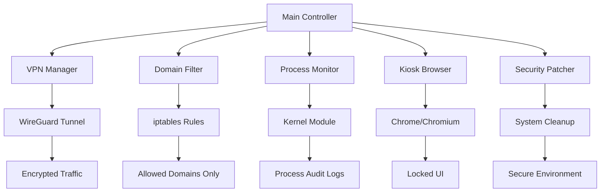

# Secure Exam System

A comprehensive Linux-based lockdown system for conducting secure online programming exams. The system provides multi-layered security through VPN tunneling, domain filtering, process monitoring, and kiosk browser isolation.

## 🎯 Quick Start

### For Administrators

```bash
# 1. Clone and navigate to the project
cd ~/secure-exam-system

# 2. Run the setup wizard
sudo python3 setup_wizard.py

# 3. Validate the installation
python3 config_validator.py

# 4. Start an exam
sudo ./exam_launcher.sh
```

### For Exam Takers

1. Wait for the administrator to start the exam system
2. The system will automatically launch in kiosk mode
3. You will only have access to the allowed exam website
4. Do not attempt to exit the browser or switch applications
5. Raise your hand if you experience technical difficulties

---

## 📋 Table of Contents

- [Architecture Overview](#architecture-overview)
- [Installation Guide](#installation-guide)
- [Configuration Reference](#configuration-reference)
- [User Guide](#user-guide)
- [Admin Guide](#admin-guide)
- [Security Model](#security-model)
- [Troubleshooting](#troubleshooting)
- [File Structure](#file-structure)

---

## 🏗️ Architecture Overview

### System Layers

The Secure Exam System implements defense-in-depth through multiple security layers:

```
┌─────────────────────────────────────────────────────────┐
│                    User Interface                        │
│              (Kiosk Browser - Locked Down)              │
└────────────────────┬────────────────────────────────────┘
                     │
┌────────────────────┴────────────────────────────────────┐
│              Application Layer                           │
│  • Main Controller                                       │
│  • Process Monitor (Allowlist Enforcement)              │
│  • Integrity Checker (File System Monitoring)           │
└────────────────────┬────────────────────────────────────┘
                     │
┌────────────────────┴────────────────────────────────────┐
│              Network Layer                               │
│  • VPN Manager (ProtonVPN/WireGuard)                    │
│  • Domain Filter (iptables-based)                       │
│  • Network Monitor (Connection Tracking)                │
└────────────────────┬────────────────────────────────────┘
                     │
┌────────────────────┴────────────────────────────────────┐
│              Security Layer                              │
│  • Security Patcher (Environment Cleanup)               │
│  • System Lockdown (AppArmor Profiles)                  │
│  • Kernel Module (Process Auditing)                     │
└─────────────────────────────────────────────────────────┘
```

### Component Interaction



### Network Flow

```
Student Machine
      │
      ├─> VPN Tunnel (WireGuard)
      │        │
      │        ├─> ProtonVPN Server
      │        │
      │        └─> Internet
      │                │
      │                ├─> codeforces.com ✓ (Allowed)
      │                ├─> google.com ✗ (Blocked by iptables)
      │                └─> github.com ✗ (Blocked by iptables)
      │
      └─> Local Processes
               │
               ├─> google-chrome ✓ (Allowed)
               ├─> xterm ✗ (Blocked/Logged)
               └─> code ✗ (Blocked/Logged)
```

### Security Mechanisms

| Layer | Mechanism | Purpose |
|-------|-----------|---------|
| **Network** | WireGuard VPN | Encrypt all traffic, prevent local network access |
| **Network** | iptables Domain Filter | Allow only whitelisted domains (e.g., codeforces.com) |
| **Process** | Allowlist Enforcement | Block unauthorized applications |
| **Process** | Kernel Module | Log all `execve` syscalls for audit |
| **Browser** | Kiosk Mode | Prevent escape via keyboard shortcuts |
| **Browser** | Key Blocking | Disable Alt+F4, Alt+Tab, Ctrl+Alt+Del |
| **System** | AppArmor Profiles | Confine browser and system processes |
| **System** | Environment Cleanup | Clear clipboard, cache, temp files |

---

## 📦 Installation Guide

### Prerequisites

- **Operating System**: Ubuntu 20.04+ or Debian 11+
- **Kernel**: Linux 5.4+ (for WireGuard support)
- **RAM**: Minimum 4GB
- **Disk**: 10GB free space
- **Network**: Active internet connection
- **Privileges**: Root/sudo access

### System Dependencies

```bash
# Update package list
sudo apt update

# Install required packages
sudo apt install -y \
    python3 \
    python3-pip \
    wireguard \
    wireguard-tools \
    iptables \
    google-chrome-stable \
    apparmor \
    apparmor-utils \
    auditd \
    build-essential \
    linux-headers-$(uname -r)

# Install Python dependencies
pip3 install -r requirements.txt
```

### ProtonVPN Setup

1. **Get ProtonVPN Configuration**:
   - Sign up at [ProtonVPN](https://protonvpn.com)
   - Download a WireGuard configuration file
   - Save it to `/etc/wireguard/exam.conf`

2. **Run the Setup Script**:
   ```bash
   sudo ./setup_protonvpn.sh
   ```

3. **Test VPN Connection**:
   ```bash
   sudo wg-quick up exam
   curl https://api.ipify.org  #or ifconfig.me Should show VPN IP
   sudo wg-quick down exam
   ```

### Kernel Module Compilation (Optional)

If you want process monitoring via the custom kernel module:

```bash
cd process_manager/kernel_monitor
make
sudo insmod proc_monitor.ko
lsmod | grep proc_monitor  # Verify it's loaded
```

### Configuration

1. **Edit Configuration File**:
   ```bash
   nano config/system_config.json
   ```

2. **Update Key Settings**:
   - `paths.project_root`: Set to your installation directory
   - `vpn.config_path`: Path to your WireGuard config
   - `network.allowed_domains`: Add your exam platform domains
   - `kiosk.browser_path`: Verify browser location
   - `admin.contact_email`: Your support email

3. **Validate Configuration**:
   ```bash
   python3 config_validator.py
   ```

---

## ⚙️ Configuration Reference

### Configuration File: `config/system_config.json`

#### Paths Section
```json
"paths": {
  "project_root": "/path/to/secure-exam-system",
  "config_dir": "${project_root}/config",
  "log_dir": "/var/log/secure-exam",
  "kernel_module": "${project_root}/process_manager/kernel_monitor/proc_monitor.ko",
  "apparmor_profiles": "${project_root}/security/profile_templates"
}
```

- **project_root**: Base directory for the system (all other paths are relative to this)
- **config_dir**: Configuration files location
- **log_dir**: Where audit and system logs are stored
- **kernel_module**: Path to the process monitoring kernel module
- **apparmor_profiles**: AppArmor profile templates directory

#### VPN Section
```json
"vpn": {
  "interface": "wg0",
  "config_path": "/etc/wireguard/exam.conf",
  "namespace": "exam_ns",
  "vpn_ip": "10.2.0.2/32",
  "vpn_gateway": "10.8.0.1",
  "kill_switch_enabled": true
}
```

- **interface**: WireGuard interface name
- **config_path**: Path to WireGuard configuration file
- **namespace**: Network namespace for testing mode isolation
- **kill_switch_enabled**: Block all traffic if VPN disconnects

#### Network Section
```json
"network": {
  "allowed_domains": [
    "codeforces.com",
    "*.codeforces.com"
  ],
  "certificate_pinning_enabled": true,
  "dns_server": "1.1.1.1"
}
```

- **allowed_domains**: Whitelist of domains accessible during exam (supports wildcards)
- **certificate_pinning_enabled**: Verify SSL certificates (future feature)
- **dns_server**: DNS server to use

#### Exam Section
```json
"exam": {
  "duration_minutes": 180,
  "start_url": "https://codeforces.com",
  "exam_name": "Programming Contest",
  "allow_early_finish": false
}
```

- **duration_minutes**: Exam duration (system auto-stops after this)
- **start_url**: URL to load when exam starts
- **exam_name**: Displayed to students
- **allow_early_finish**: Whether students can exit before time expires

#### Kiosk Section
```json
"kiosk": {
  "browser": "google-chrome",
  "browser_path": "/usr/bin/google-chrome",
  "fullscreen": true,
  "disable_dev_tools": true,
  "disable_context_menu": true,
  "user_data_dir": "/tmp/exam-browser-profile"
}
```

- **browser**: Browser name
- **browser_path**: Full path to browser executable
- **fullscreen**: Launch in fullscreen kiosk mode
- **disable_dev_tools**: Block F12/DevTools
- **disable_context_menu**: Block right-click menu
- **user_data_dir**: Temporary profile directory

#### Security Section
```json
"security": {
  "use_apparmor": true,
  "profile_name": "exam-lockdown",
  "integrity_check_enabled": true,
  "enable_key_blocking": true,
  "clear_clipboard": true,
  "clear_browser_cache": true
}
```

- **use_apparmor**: Enable AppArmor confinement
- **enable_key_blocking**: Block Alt+F4, Alt+Tab, etc.
- **clear_clipboard**: Wipe clipboard on start/stop
- **clear_browser_cache**: Remove browser cache before exam

#### Admin Section
```json
"admin": {
  "contact_email": "admin@example.com",
  "emergency_phone": "+1-XXX-XXX-XXXX",
  "support_url": "https://support.example.com"
}
```

- **contact_email**: Admin email for student support
- **emergency_phone**: Phone number for urgent issues
- **support_url**: Link to support documentation

---

## 👤 User Guide

### Before the Exam

1. **System Requirements**:
   - Ensure your laptop is fully charged
   - Close all applications
   - Disable any VPN or proxy software
   - Ensure stable internet connection

2. **What to Expect**:
   - The administrator will start the exam system
   - Your screen will lock into the exam platform
   - You will not be able to:
     - Open other applications
     - Access other websites
     - Use keyboard shortcuts to exit
     - Access the terminal or file manager

### During the Exam

1. **Allowed Actions**:
   - Navigate within the exam platform
   - Write and submit code
   - Use allowed features of the exam platform

2. **Prohibited Actions**:
   - Do not attempt to exit the browser
   - Do not try to open other applications
   - Do not disconnect from the network
   - Do not restart the computer

3. **If You Experience Issues**:
   - Raise your hand immediately
   - Do not attempt to fix it yourself
   - Wait for administrator assistance

### After the Exam

- The administrator will stop the system
- Your screen will return to normal
- All exam logs will be collected for review

---

## 👨‍💼 Admin Guide

### Pre-Exam Setup

1. **Test the System** (1 day before):
   ```bash
   # Run in testing mode
   sudo ./test_complete.sh
   ```

2. **Configure the Exam** (1 hour before):
   - Update `config/system_config.json`:
     - Set `exam.duration_minutes`
     - Set `exam.start_url`
     - Set `network.allowed_domains`
   - Validate configuration:
     ```bash
     python3 config_validator.py
     ```

3. **Prepare Student Machines**:
   - Ensure all dependencies are installed
   - Test VPN connectivity
   - Verify browser launches correctly

### Starting the Exam

```bash
# 1. Switch to production mode (edit config or use setup wizard)
nano config/system_config.json  # Set "mode": "production"

# 2. Launch the exam system
sudo ./exam_launcher.sh

# 3. Verify system status
# - VPN should be connected
# - Domain filter should be active
# - Browser should be in kiosk mode
```

### Monitoring During Exam

```bash
# Check VPN status
sudo wg show

# Check iptables rules
sudo iptables -L EXAM_FILTER -v -n

# Monitor audit logs
sudo ausearch -k app_exec -ts today

# Check system logs
sudo tail -f /var/log/secure-exam/exam.log
```

### Handling Issues

| Issue | Solution |
|-------|----------|
| **Student can't access exam site** | Check `allowed_domains` in config, verify DNS |
| **VPN won't connect** | Check `/etc/wireguard/exam.conf`, verify ProtonVPN credentials |
| **Browser won't launch** | Verify `browser_path` in config, check browser installation |
| **Student locked out** | Use emergency restore: `sudo ./EMERGENCY_RESTORE_NETWORK.sh` |

### Stopping the Exam

```bash
# The system will auto-stop after exam duration
# Or manually stop:
sudo pkill -f exam_launcher.sh

# Collect logs
sudo tar -czf exam-logs-$(date +%Y%m%d).tar.gz /var/log/secure-exam/
```

### Post-Exam Analysis

```bash
# Analyze audit logs
python3 monitoring/log_analyzer.py --date today

# Generate security report
python3 monitoring/log_analyzer.py --report --output exam-report.csv
```

---

## 🔒 Security Model

### What is Protected

#### ✅ Cheating Methods Detected

| Method | Detection Mechanism | Action Taken |
|--------|---------------------|--------------|
| **Opening unauthorized applications** | Process allowlist + kernel module | Process blocked, logged to audit |
| **Accessing non-exam websites** | iptables domain filter | Connection blocked, logged |
| **Attempting to exit browser** | Key blocking (Alt+F4, etc.) | Keys disabled, attempt logged |
| **Switching virtual consoles** | TTY lockdown (production) | Access denied, logged |
| **Modifying system files** | Integrity checker | Changes detected, logged |
| **Clipboard manipulation** | Clipboard clearing | Clipboard wiped on start/stop |
| **Browser cache exploitation** | Cache clearing | Cache deleted before exam |
| **Network traffic to unauthorized IPs** | iptables OUTPUT rules | Packets dropped, logged |

#### ❌ Cheating Methods NOT Detected

| Method | Why Not Detected | Mitigation |
|--------|------------------|------------|
| **Physical notes/books** | No camera monitoring | Physical proctoring required |
| **Second device (phone, tablet)** | No device detection | Physical proctoring required |
| **Screen sharing to another person** | No screen capture detection | Physical proctoring required |
| **Camera-based cheating** | No camera monitoring | Physical proctoring required |
| **Collusion between students** | No communication monitoring | Physical separation required |
| **Pre-downloaded solutions** | No memory inspection | Randomized questions recommended |
| **Hardware keyloggers** | No hardware inspection | Physical inspection required |
**VM based cheating** | No hardware inspection | hardware inspection required |

### Threat Model

#### Assumptions

1. **Physical Security**: The exam is conducted in a controlled environment with physical proctoring
2. **Trusted Administrator**: The person running the system is trustworthy
3. **Network Security**: The local network is not compromised
4. **Hardware Integrity**: Student machines are not pre-compromised

#### Out of Scope

- **Sophisticated Attackers**: Nation-state level attacks, custom kernel exploits
- **Hardware Attacks**: BIOS/UEFI modifications, hardware keyloggers
- **Social Engineering**: Bribing proctors, impersonation
- **Physical Attacks**: Destroying equipment, power outages

### Security Layers Explained

#### Layer 1: Network Isolation

**Technology**: WireGuard VPN + iptables

**How it works**:
1. All traffic is routed through an encrypted VPN tunnel
2. iptables rules drop all packets except to whitelisted domains
3. DNS queries are monitored and filtered

**Bypass difficulty**: ⭐⭐⭐⭐ (Very Hard)
- Requires kernel-level network stack manipulation
- VPN kill switch prevents leaks

#### Layer 2: Process Control

**Technology**: Process allowlist + Kernel module

**How it works**:
1. Kernel module logs all `execve` syscalls
2. Process monitor checks running processes against allowlist
3. Unauthorized processes are terminated

**Bypass difficulty**: ⭐⭐⭐ (Hard)
- Requires privilege escalation or kernel exploit
- Logs provide audit trail

#### Layer 3: Browser Lockdown

**Technology**: Kiosk mode + Key blocking

**How it works**:
1. Browser runs in fullscreen kiosk mode
2. Keyboard shortcuts (Alt+F4, F11, etc.) are disabled via `xmodmap`
3. DevTools and context menu are disabled

**Bypass difficulty**: ⭐⭐ (Medium)
- Can be bypassed with window manager tricks
- Requires knowledge of X11 internals

#### Layer 4: System Hardening

**Technology**: AppArmor + Environment cleanup

**How it works**:
1. AppArmor profiles confine browser and system processes
2. Clipboard is cleared
3. Browser cache and temp files are deleted

**Bypass difficulty**: ⭐⭐⭐⭐ (Very Hard)
- Requires AppArmor bypass or kernel exploit

---

## 🐛 Troubleshooting

### Common Issues

#### VPN Won't Connect

**Symptoms**: `wg-quick up exam` fails

**Solutions**:
1. Check WireGuard config:
   ```bash
   sudo cat /etc/wireguard/exam.conf
   ```
2. Verify WireGuard is installed:
   ```bash
   wg version
   ```
3. Check kernel module:
   ```bash
   lsmod | grep wireguard
   ```
4. Test with verbose output:
   ```bash
   sudo wg-quick up exam --verbose
   ```

#### Domain Filter Blocks Everything

**Symptoms**: Can't access any websites, including allowed ones

**Solutions**:
1. Emergency restore:
   ```bash
   sudo ./EMERGENCY_RESTORE_NETWORK.sh
   ```
2. Check iptables rules:
   ```bash
   sudo iptables -L EXAM_FILTER -v -n
   ```
3. Verify DNS resolution:
   ```bash
   nslookup codeforces.com
   ```

#### Browser Won't Launch

**Symptoms**: Kiosk browser fails to start

**Solutions**:
1. Check browser path:
   ```bash
   which google-chrome
   ```
2. Test browser manually:
   ```bash
   google-chrome --version
   ```
3. Check DISPLAY variable:
   ```bash
   echo $DISPLAY
   ```
4. Verify user permissions:
   ```bash
   sudo -u $USER google-chrome --version
   ```

#### Audit Logs Missing

**Symptoms**: `ausearch` returns no results

**Solutions**:
1. Check if auditd is running:
   ```bash
   sudo systemctl status auditd
   ```
2. Start auditd:
   ```bash
   sudo systemctl start auditd
   ```
3. Verify audit rules:
   ```bash
   sudo auditctl -l
   ```

### Emergency Procedures

#### Student Locked Out

If a student cannot access the exam platform:

1. **Verify VPN**:
   ```bash
   sudo wg show
   ```

2. **Check Domain Filter**:
   ```bash
   sudo iptables -L EXAM_FILTER -v -n | grep codeforces
   ```

3. **Test Connectivity**:
   ```bash
   curl -I https://codeforces.com
   ```

4. **Temporary Bypass** (last resort):
   ```bash
   sudo ./EMERGENCY_RESTORE_NETWORK.sh
   # Student completes exam
   # Re-enable security after
   ```

#### System Crash

If the exam system crashes:

1. **Collect Logs**:
   ```bash
   sudo journalctl -xe > crash-log.txt
   sudo dmesg > kernel-log.txt
   ```

2. **Restore Network**:
   ```bash
   sudo ./EMERGENCY_RESTORE_NETWORK.sh
   ```

3. **Restart Exam** (if time permits):
   ```bash
   sudo ./exam_launcher.sh
   ```

---

## 📁 File Structure

```
secure-exam-system/
├── config/
│   ├── system_config.json          # Main configuration file
│   ├── exam.conf                    # WireGuard VPN config (symlink)
│   └── wireguard-template.conf     # VPN config template
│
├── network/
│   ├── vpn_manager.py              # VPN tunnel management
│   ├── domain_filter.py            # iptables-based domain filtering
│   ├── kiosk_browser.py            # Locked-down browser launcher
│   ├── network_monitor.py          # Connection tracking
│   └── test_namespace.sh           # Network namespace testing
│
├── process_manager/
│   ├── process_monitor.py          # Process allowlist enforcement
│   ├── process_enforcer.py         # Process termination logic
│   ├── allowlist_builder.py        # Generate process allowlists
│   └── kernel_monitor/
│       ├── proc_monitor.c          # Kernel module source
│       ├── proc_monitor.ko         # Compiled kernel module
│       └── Makefile                # Build configuration
│
├── security/
│   ├── security_patcher.py         # Environment cleanup
│   ├── system_lockdown.py          # AppArmor profile management
│   ├── integrity_checker.py        # File system monitoring
│   └── profile_templates/
│       └── exam_apparmor.profile   # AppArmor profile template
│
├── monitoring/
│   ├── log_analyzer.py             # Audit log analysis
│   └── realtime_dashboard.py      # Web-based monitoring (future)
│
├── docs/
│   ├── USER_GUIDE.md               # Student instructions
│   ├── ADMIN_GUIDE.md              # Administrator manual
│   ├── ARCHITECTURE.md             # Technical architecture
│   ├── SECURITY.md                 # Security model details
│   └── DEPLOYMENT.md               # Production deployment guide
│
├── tests/
│   ├── test_phase2.py              # Network layer tests
│   ├── test_phase3.py              # Process monitoring tests
│   ├── test_phase4.py              # Integration tests
│   └── integration_test.sh         # Full system test
│
├── utils/
│   └── emergency_shutdown.sh       # Emergency stop script
│
├── main_controller.py              # Main orchestration script
├── exam_launcher.sh                # Exam startup script
├── config_validator.py             # Configuration validation
├── setup_wizard.py                 # Interactive setup (future)
├── install.sh                      # Installation script (future)
├── validate_installation.py        # Installation validator (future)
│
├── test_complete.sh                # Comprehensive test script
├── test_vpn_production.sh          # VPN + filter test
├── test_app_kernel_logging.sh      # Audit logging test
├── debug_kernel_logging.py         # Kernel log debugging
├── EMERGENCY_RESTORE_NETWORK.sh    # Network recovery script
│
├── requirements.txt                # Python dependencies
├── README.md                       # This file
├── SAFETY.md                       # Safety documentation
├── BUGFIXES.md                     # Bug fix log
└── red_team_analysis.md            # Security vulnerability analysis
```

### Key Files Explained

| File | Purpose | When to Edit |
|------|---------|--------------|
| `config/system_config.json` | All system settings | Before each exam |
| `exam_launcher.sh` | Starts the exam system | Rarely (only for customization) |
| `main_controller.py` | Orchestrates all components | Never (unless developing) |
| `config_validator.py` | Validates configuration | Never (run before exam) |
| `EMERGENCY_RESTORE_NETWORK.sh` | Restores network access | Never (emergency use only) |

---

<!-- ## 📞 Support

- **Email**: admin@example.com
- **Documentation**: [Full Documentation](docs/)
- **Issues**: Report bugs via email or issue tracker
- **Emergency**: +1-XXX-XXX-XXXX

--- -->

<!-- ## 📄 License

This project is for educational and authorized exam administration purposes only.

--- -->

<!-- ## 🙏 Acknowledgments

- ProtonVPN for VPN infrastructure
- WireGuard for secure tunneling
- Linux kernel community for audit subsystem
- Codeforces for exam platform

--- -->

**Last Updated**: 2025-11-26  
**Version**: 1.0.0
